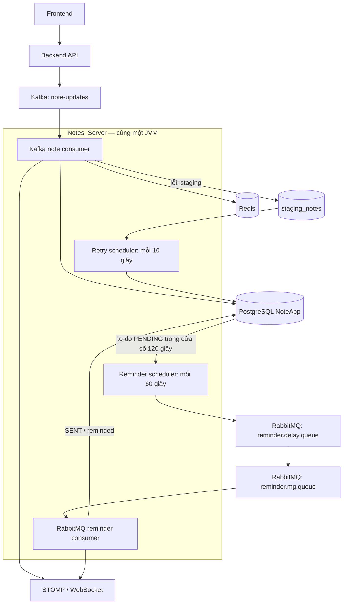

# Backend production — TablePlus & Dokploy

> Historical initial snapshot. Production changed after this review: use [hardening evidence](production-hardening-20261005.md) and [current Notion runbook](https://app.notion.com/p/3f084e0b99dd813d927dd749ed5f6661). PostgreSQL now uses observer via localhost:15433; Redis observer via :16379; broker host ports removed; BE uses pinned ACL-enabled image. Connection instructions below describe the superseded snapshot.

Review ngày 05/10/2026. Phạm vi: backend `notesWeb`, database và worker xử lý job/message. Đây là kết quả kiểm tra và checklist đề xuất; chưa sửa code hoặc redeploy production.

## Kết quả đã xác minh

| Hạng mục | Kết quả |
|---|---|
| Repo local | Nhánh `feature/Maintain`, commit `ecf4c2b90b7adf85403be1a1b438ddc6c455edca` |
| Build Docker | Thành công với Java 21; image local `notesweb-be:review-20261005`, ID `3244a2ec0d7d` |
| Tests | Dockerfile dùng `-DskipTests`; chưa chạy integration test trong lần review này |
| Backend Dokploy | `Notes_Server`, service `nnnoteswebapp-notesserver-oubfhi`, 1/1 Running, port 8081 |
| Nguồn deploy | Docker registry `nntn/notes-app:latest`, không build trực tiếp từ repo trong Dokploy |
| Revision image live | OCI label `56b631c8d842405e9066edea02a5379cc0059b29`, version `main`; khác commit local |
| Lịch sử deploy | Hai deployment gần nhất hiển thị Done; deployment mới nhất khoảng 5 tháng trước |
| PostgreSQL | 15.19, database `NoteApp`, volume `nnnoteswebapp-notespostgres-rbrlzd-data` |
| TablePlus | Connection `NoteAppProduct` đã kết nối được, hiển thị PostgreSQL 15.19 và schema public |
| RabbitMQ worker | `reminder.mg.queue`: 1 consumer, 0 ready, 0 unacked tại thời điểm kiểm tra |
| Kafka worker | Group `note-update-group` có consumer được gán `note-updates-0`; log-end-offset 0, chưa có committed offset |

Broker metadata xác nhận consumer đã kết nối, chưa chứng minh job xử lý end-to-end thành công. Không tạo message hoặc sửa dữ liệu production để thử. Findings về code bên dưới áp dụng cho commit local; chưa đối chiếu bytecode toàn bộ image live.

## Kết nối TablePlus

Máy chạy Dokploy là VM OrbStack `nntn-vps` trên Mac này. Đường kết nối hiện hoạt động:

| Trường | Giá trị |
|---|---|
| Driver | PostgreSQL |
| Name | NoteAppProduct |
| Tag | production |
| Host | `127.0.0.1` |
| Port | `5433` |
| User | `postgres` — credential hiện có |
| Database | `NoteApp` — giữ đúng chữ hoa/thường |
| Password | Dùng credential đã lưu trong TablePlus; không ghi trong docs |

URI không chứa password: `postgresql://postgres@127.0.0.1:5433/NoteApp`.

IP VM `192.168.139.117:5433` trả “No route to host” từ Mac trong lần kiểm tra này; localhost kết nối thành công. Localhost chỉ áp dụng trên Mac đang chạy OrbStack, không phải hostname để truy cập từ máy khác. Domain `server.nhannotes.id.vn` phục vụ HTTP backend, không dùng làm host PostgreSQL.

Fallback SSH nếu localhost forwarding không còn hoạt động:

```sh
ssh -N -o ExitOnForwardFailure=yes -L 127.0.0.1:15433:127.0.0.1:5433 nntn-vps@orb
```

Sau đó TablePlus dùng `127.0.0.1:15433`. SSH login `nntn-vps@orb` đã xác minh; tunnel fallback chưa cần chạy. [OrbStack SSH](https://docs.orbstack.dev/machines/ssh) hướng dẫn alias `orb` và port forwarding.

- [x] Test và mở đúng database NoteApp, không dùng connection Redis của dự án khác.
- [ ] Dùng tài khoản read-only cho truy vấn thường ngày; `postgres` hiện là tài khoản có quyền cao.
- [ ] Bật Safe Mode và kiểm tra transaction trước thao tác ghi production.
- [ ] Giữ database trong mạng nội bộ; kiểm tra firewall của port 5433 hiện publish trên VM, không thêm public domain cho DB.
- [ ] Lập lịch backup riêng cho NoteApp và thử restore vào môi trường tách biệt. Backup Dokploy control-plane không thay thế backup ứng dụng.

Tham khảo: [Dokploy database connections](https://docs.dokploy.com/docs/core/databases/connection), [database backups](https://docs.dokploy.com/docs/core/databases/backups), [TablePlus connection management](https://tableplus.com/docs/gui-tools/manage-connections).

## Flow worker hiện tại

Không thiếu service worker độc lập theo kiến trúc local hiện tại: API, Kafka listener, RabbitMQ listener và scheduler đều được Spring khởi chạy trong cùng JVM. Consumer đang hoạt động trong deployment BE. Tạo thêm service từ cùng image có thể khởi chạy thêm scheduler/API và gây xử lý trùng.



## Checklist ưu tiên

### P1 — Bảo toàn job và dữ liệu

- [ ] **Chỉ ACK Kafka sau khi DB commit hoặc staging/DLT lưu thành công.** `TaskNoteService.handleFailure` bắt cả lỗi lưu staging rồi trả null (`service/takeNotes/TaskNoteService.java:115–142`); consumer vẫn ACK khi null hoặc sau handleFailure (`exception/kafka/kafkaNoteConsumer.java:55–71`). Nếu DB và staging cùng lỗi, message có thể mất khả năng retry. Cho lỗi persistence nổi lên để broker retry; bổ sung test tình huống này.
- [ ] **Retry phải xác nhận update thành công trước khi xóa staging.** `exception/kafka/handleStaging/noteRetryScheduler.java:52–54` bỏ qua return value; fallback trả null vẫn bị coi là thành công. Không tạo staging mới vô hạn qua fallback trong mỗi retry; quản lý attempt trên event hiện tại.
- [ ] **Lọc retry đủ điều kiện ngay trong query.** Scheduler lấy 50 dòng đầu rồi bỏ qua `retryCount >= 5` (`noteRetryScheduler.java:31–41`); 50 dòng hết lượt có thể chặn các job phía sau. Thêm trạng thái dead-letter, `nextAttemptAt`, backoff và cơ chế claim/lock.
- [ ] **Persist Kafka và RabbitMQ trước khi thay container.** Live service inspect hiện `Mounts=null` cho cả hai. Dữ liệu nằm trong filesystem container có thể mất khi task được thay. Chọn volume và phương án migration/backup trước redeploy; volume trên một node chưa phải HA.
- [ ] **Xử lý reminder quá hạn sau downtime.** `repository/todoRepo/TodoRepo.java:20–24` chỉ chọn `triggerAt >= now`; các reminder PENDING đã quá hạn có thể bị bỏ qua mãi. Định nghĩa chính sách catch-up và tránh gửi trùng.
- [ ] **Dùng transactional outbox cho DB → RabbitMQ.** `ReminderScheduler.java:42–45` đổi state QUEUE và publish trong DB transaction nhưng không có atomic commit giữa broker và DB. Publish thành công/DB rollback có thể gửi trùng; cần publisher confirm, retry và reconciliation.
- [ ] **Claim reminder và thiết kế idempotency trước khi scale/rolling update.** Query không có lock; nhiều JVM có thể chọn cùng dòng PENDING. `ReminderQueueConsume.java:35–39` gửi notification trước DB commit; cần event ID, claim hoặc conditional update, cùng cơ chế chống trùng và kiểm tra job bị kẹt QUEUE.

### P2 — Build và deploy có thể truy vết

- [ ] **Promote image sau integration tests.** `.github/workflows/CI.yml:72–82` push cả tag latest trước integration tests; bước Promote ở dòng 162 chỉ echo. Deploy job có gate tests nhưng latest trong registry vẫn có thể đã trỏ tới build lỗi. Push SHA candidate, test đúng artifact, rồi promote digest thành công.
- [ ] Deploy bằng SHA tag/digest và ghi revision trong release; hiện local commit và live image khác nhau, không thể coi build local là code đang chạy.
- [ ] Chạy tests trong môi trường riêng. Unit-test step hiện loại `NotesWebApplicationTests` và cho phép không có tests; không dùng kết quả đó làm bằng chứng đã kiểm tra worker.
- [ ] Thêm readiness/liveness endpoint rồi cấu hình healthcheck thật trong Dokploy. Live backend `Health=null`; không coi Swagger 200 hoặc trạng thái Running là worker khỏe. Theo dõi consumer count, failed jobs, queue age và scheduler last-run. [Dokploy healthchecks](https://docs.dokploy.com/docs/core/applications/zero-downtime).
- [ ] Dùng migration versioned (Flyway/Liquibase), chuyển production `ddl-auto` sang validate sau baseline và backup. Local config hiện mặc định update.
- [ ] Đồng nhất profile Spring và envLoader: envLoader đọc JVM system property, trong khi deploy thường dùng Spring environment; bỏ default local trong production packaging.
- [ ] Giảm Kafka concurrency từ 8 theo số partition và tải thực tế; topic live hiện chỉ có một partition nên chỉ một consumer trong group được phân công.
- [ ] Chạy runtime bằng user không phải root; thêm `.dockerignore`, tên artifact rõ ràng, BOM dependency thống nhất và `<scope>test</scope>` cho `spring-boot-starter-test`.
- [ ] Đặt resource limits cho broker; hiện BE có limit 1 GiB, Kafka/RabbitMQ/PostgreSQL không có limit được cấu hình.
- [ ] PostgreSQL đang `start-first` với cùng volume; đổi chiến lược cập nhật có kiểm soát để tránh hai postmaster dùng chung dữ liệu. Không áp dụng zero-downtime stateless cho DB singleton.

## Nếu tách API và worker trong tương lai

- [ ] Gating listeners/schedulers bằng property hoặc profile rõ ràng; API replica không tự chạy scheduled jobs khi bị tắt.
- [ ] Worker có lifecycle/health riêng; chỉ tạo app worker trong Dokploy sau khi các flag được triển khai và test.
- [ ] Scheduler dùng leader/DB claim; Kafka group bảo đảm phân công partition nhưng không bảo vệ scheduler.
- [ ] Worker gửi realtime thông qua broker/relay dùng chung; không dựa vào session WebSocket trong bộ nhớ của một instance API.
- [ ] Test crash trước/sau commit, broker outage, duplicate delivery, poison message và redeploy; chạy trên staging trước production.

## Giới hạn kiểm tra

### Bổ sung Redis worker — 05/10/2026

`RedisConsumerConfig` khởi chạy ba consumer trong cùng BE sau ApplicationReady: Auth (`auth:login:stream` / `auth-group`, pool 20), Note create (`notes:create:stream` / `notes-group`, pool 10), Media (`media:create:stream` / `media-group`, pool 8). Pool sizes là cấu hình source local, chưa đối chiếu bytecode live.

Live container log xác nhận cả ba consumer; Redis có 3 kết nối XREADGROUP. Các group pending=0, lag=0; mỗi group có 284 consumer entries lịch sử, không phải 284 worker active. Redis có volume `/data`, RDB bật, AOF tắt. Chưa thử delivery end-to-end.

- [ ] P1: bỏ raw Auth record log chứa password; retention/access cho login stream và terminal FAILED/EXPIRED cho polling.
- [ ] P1: base consumer ACK sau handler return; các nhánh Note/Media catch/rate-limit vẫn return hoặc ACK. Lỗi transient phải giữ pending, permanent failure phải lưu bền vững trước ACK.
- [ ] P2: reclaim định kỳ có cursor/backoff — hiện chỉ claim tối đa 20 lúc startup; bounded queue, graceful shutdown và dedup DB. PROCESSING không phải DONE.
- [ ] P2: review persistence/backup cho accepted work; dọn consumer entries cũ có kiểm tra pending, không xóa mù.

Gate CI bổ sung: DB/Redis outage, rate-limit, crash trước/sau commit, duplicate, reclaim backlog >20, polling failure và kiểm tra không có password trong logs. [Redis XACK](https://redis.io/docs/latest/commands/xack/) · [XAUTOCLAIM](https://redis.io/docs/latest/commands/xautoclaim/).

Build xác minh Dockerfile local trên arm64, không xác minh image amd64 hay startup với toàn bộ cấu hình production. Không chạy context test với credential production, không sửa infrastructure và không redeploy BE/worker. Các thay đổi `.DS_Store` và việc README.md đã bị xóa là trạng thái có sẵn trước review, được giữ nguyên.
